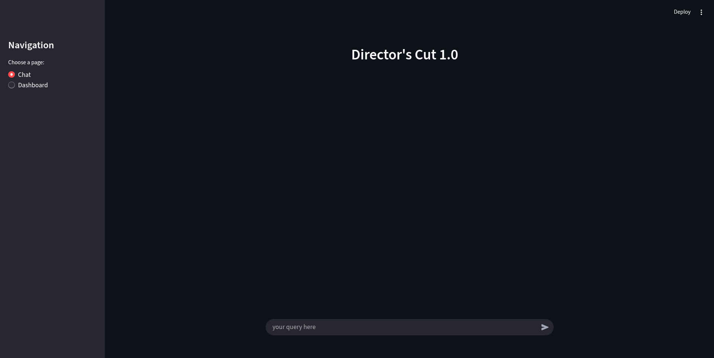
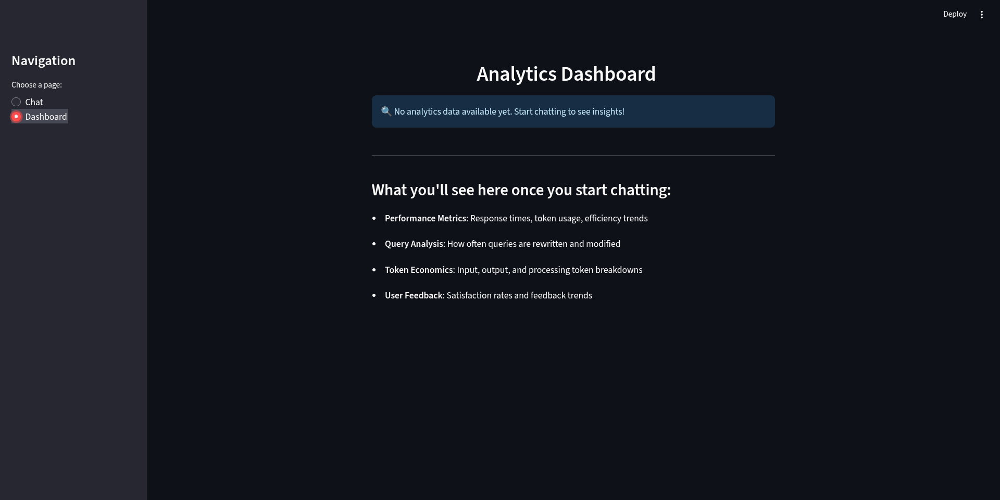

# Directors-cut-1.0
Essential film making techniques, from shots to editing, all in one place.

## Problem Description

<p>🎬 Filmmaking has tons of terms for shots, camera moves, editing, and lighting—but info is scattered everywhere!</p>

<p>✨ <strong>Directors-Cut-1.0</strong> brings it all together in one place. With type, term, definition, and extra, it’s easy to explore and learn filmmaking concepts without hunting through multiple sources. 📚</p>

<h2>📁 Project Structure</h2>
<pre>
Directors-cut-1.0/
├── data/
│     ├── data.json
│     ├── generate_ids.py
│     └── raw_data.json
├── evaluation/
│     ├── ground_truth.ipynb
│     ├── ground_truth.csv
│     ├── llm_as_judge.ipynb
│     └── retrieval_evaluation.ipynb
├── ingestion/
│     ├── __init__.py
│     └── ingest.py
├── retrieval/
│     ├── __init__.py
│     ├── query_rewrite.py   
│     ├── response.py
│     └── search.py
├── ui/
│     └── app.py
├── .env.example
├── .gitignore
├── docker-compose.yaml
├── Dockerfile
├── environment.yaml
├── README.md
└── setup.sh
</pre>

## Preview

This is what the overall project looks like:

**💬 Chat Interface**  


**📊 Dashboard View**  


                                        
## 🚀 Getting Started

This guide provides two options for setting up and running this project.

-----

### Clone git repository

```bash
git clone https://github.com/Danodia-Rahul/Directors-cut-1.0.git
cd Directors-cut-1.0
```
----

**Important:** Before running the application, create a `.env` file in the project root.
You can use the provided `.env.example` as a template and replace the placeholder values with your own (for example, your `GOOGLE_API_KEY`).


### 💻 Option A: Local Setup with Conda  
Recommended setup (this project was built with **Conda**).  

1. **Start Qdrant** (in Docker):  
   ```bash
    docker pull qdrant/qdrant
    docker run -d -p 6333:6333 -p 6334:6334 \
       -v "$(pwd)/qdrant_storage:/qdrant/storage:z" \
       qdrant/qdrant

2. **Install Miniconda** → [Download here](https://docs.conda.io/en/latest/miniconda.html)

3. **Create & activate environment:**

   ```bash
   conda env create -f environment.yml
   conda activate project
   ```

4. **Ingest data into Qdrant:**

   ```bash
   python -m ingestion.ingest
   ```

5. **Launch the Streamlit app:**

   ```bash
   streamlit run ui/app.py
   ```

Everything’s ready! You can access:  

- **Qdrant Dashboard** → [http://localhost:6333/dashboard](http://localhost:6333/dashboard)  
- **Streamlit App** → [http://localhost:8501](http://localhost:8501)  


### 🐳 Option B: Containerized Setup with Docker

You can also use **Docker** for a self-contained environment. Make sure no other container is using port **6333** and **8501**.

1. **Build the Docker image:**
   ```bash
   docker compose build
   ```

2. **Run the app in Docker:**

   ```bash
   docker compose up
   ```

---
Once running, you can access:

* **Qdrant Dashboard** → [http://localhost:6333/dashboard](http://localhost:6333/dashboard)
* **Streamlit App** → [http://localhost:8501](http://localhost:8501)

## Data

The dataset was curated by scraping filmmaking resources such as *StudioBinder*, *MetFilm School*, and *Art Department*.  
Each source had a unique structure, so we wrote **custom scrapers** for each site instead of a single generic one.  

**Note:**  
- Scraping scripts are **not included** in this repo (they were highly tailored and not reusable).  
- The dataset is intended **only for academic and research purposes**.  
- Original site **terms of service** and copyright were respected.  

**Format:**  
Every record follows a simple schema →  
`type | term | definition | extra`  

This makes it easy to index, search, and evaluate across different retrieval methods.


## Evaluation

### Retrieval Evaluation
For retrieval evaluation, we experimented with several approaches:

- **Keyword Search:** Simple matching based on keywords.  
- **Semantic Search:** Uses embeddings to find semantically similar items.  
- **Multi-Stage Search:** Combines keyword and semantic search in multiple stages.  
- **Re-Ranking Fusion (RRF) Search:** Combines multiple retrieval strategies and re-ranks the results.

#### Results

        | Method               | MRR    | Hit Rate |
        |----------------------|--------|----------|
        | Keyword Search       | 0.7162 | 0.8347   |
        | Semantic Search      | 0.8449 | 0.9288   |
        | Multi-Stage Search   | 0.8013 | 0.9397   |
        | RRF Search           | 0.8638 | 0.9421   |

For our use case, we selected **RRF Search** as it achieved the highest recall (Hit Rate) and precision (MRR).

### RAG Evaluation

For the retrieval-augmented generation (RAG) evaluation, we used a large language model (LLM) as the judge. Specifically, we tested the generated responses from two models: **Gemini 2.5 Flash** and **Gemini 2.5 Flash Lite**.  

Due to daily rate limits, we evaluated a subset of **200 queries** from the [ground_truth.csv](./evaluation/ground_truth.csv) dataset. This allowed us to assess the performance of both models while staying within the API constraints.

#### Results

        | Model                | Relevant | Partially Relevant | Not Relevant |
        |----------------------|----------|--------------------|--------------|
        | Gemini 2.5 Flash     | 174      | 18                 | 8            |
        | Flash Lite           | 176      | 14                 | 10           |

#### Interpretation
- **Gemini 2.5 Flash** produces fewer *non-relevant* responses, reducing the risk of irrelevant retrievals.  
- It also maintains a slightly higher number of *partially relevant* cases, which still provide some useful context.  
- **Flash Lite** is stricter, shifting some cases into either *relevant* or *not relevant*, but at the cost of more outright irrelevant results.  

#### Conclusion
Given these observations, we selected **Gemini 2.5 Flash** for generating responses, as it provides a better balance between minimizing irrelevant outputs and preserving partially useful information.

## Notebooks

All notebooks in the `evaluation/` folder were built and tested in **Google Colab**.
They rely on Colab’s **secrets storage** to securely access API keys (e.g., Google GenAI).

If you plan to run them in Colab, make sure your **Google GenAI API key** is saved in *Colab secrets*.

